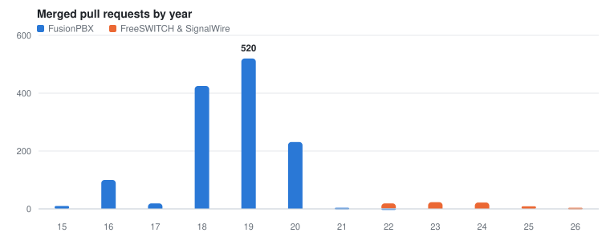

## Hi, I'm Len

I build voice AI agents — the kind you can pick up a phone and actually talk to.

Most of my work lives at the seam where telephony meets LLMs: real calls, real APIs,
real WebRTC video in the browser, built on the [SignalWire AI Agents SDK](https://developer.signalwire.com/agents-sdk).
I came to it from the PBX side — a decade of FusionPBX and FreeSWITCH — and that
shapes how I build: get the proof of concept working end to end on real
infrastructure first, then add the polish on top of something that already holds
up on a live call.

Pittsburgh, PA.

### Upstream

Open-source contributions to external projects, since 2015 — primarily FusionPBX,
FreeSWITCH and SignalWire.

| | |
|---|---|
| **1,426** pull requests merged | 96% of the 1,478 I opened |
| **372** issues opened | 94% of them closed |

<picture>
  <source media="(prefers-color-scheme: dark)" srcset="chart-dark.svg">
  
</picture>

Of the merged pull requests, 1,390 landed in public repositories (97%) and 36 in
private ones (3%). The public ones:

| Project | Merged | PRs | Span |
|---|--:|--:|---|
| [fusionpbx/fusionpbx](https://github.com/fusionpbx/fusionpbx) | 1,012 | 1,031 | 2015–2021 |
| [fusionpbx/fusionpbx-install.sh](https://github.com/fusionpbx/fusionpbx-install.sh) | 171 | 177 | 2016–2022 |
| [fusionpbx/fusionpbx-docs](https://github.com/fusionpbx/fusionpbx-docs) | 120 | 127 | 2015–2020 |
| [signalwire/freeswitch-docs](https://github.com/signalwire/freeswitch-docs) | 27 | 28 | 2023–2026 |
| [signalwire/WireStarter](https://github.com/signalwire/WireStarter) | 21 | 22 | 2022–2024 |
| [signalwire/digital_employees](https://github.com/signalwire/digital_employees) | 13 | 13 | |
| [signalwire/freeswitch](https://github.com/signalwire/freeswitch) | 4 | 4 | |

Plus smaller sets in [freeswitch/verto-client](https://github.com/freeswitch/verto-client),
[freeswitch/freeswitch-sounds](https://github.com/freeswitch/freeswitch-sounds),
[signalwire/libstirshaken](https://github.com/signalwire/libstirshaken) and
[signalwire/docs-legacy](https://github.com/signalwire/docs-legacy).

### Built and maintained by me

Chess is mine start to finish. Sidecar began as an earlier prototype from
[Brian](https://github.com/briankwest); I did the bulk of the build.

| | |
|---|---|
| **[Chess](https://github.com/signalwire-demos/chess)** · sole author | Play live chess against an agent over a realtime connection |
| **[Sidecar](https://github.com/signalwire-demos/sidecar)** · primary author | AI assisting a human rep on a live call, rather than replacing them |

### Things you can actually talk to

Team projects I contributed to. These are live — call them, or click the video
button and talk in the browser.

| | |
|---|---|
| **[Holy Guacamole](https://holyguacamole.signalwire.io)** | Drive-thru ordering |
| **[CineBot](https://cinebot.signalwire.io)** | Movie and TV discovery, with trailers, over video |
| **[Blackjack](https://blackjack.signalwire.io)** | Play 21 against an AI dealer over WebRTC video |
| **[Bobby's Table](https://bobbystable.ai)** | Restaurant reservations, start to finish |
| **[After Hours](https://afterhours.signalwire.io)** | After-hours HVAC intake and dispatch |
| **[Santa](https://santa.signalwire.io)** | Seasonal, and a hit with the under-10 crowd |
| **[Tech Tarot](https://techtarot.signalwire.io)** | Exactly what it sounds like |
| **[Cabby](https://cabby.signalwire.io)** | Taxi booking |
| **[GoAir](https://goair.signalwire.io)** | Airline agent doing real work against real APIs |

### ClueCon

The maker challenges and stage tooling I've built for ClueCon, the annual FreeSWITCH
and telephony developer conference.

**2026 — [The Prompt Pit](https://github.com/Len-PGH/prompt_pit)** · sole author
A live, esports-style control room for the Vibe Coding Championship. One container drives
every screen in the room — stage, scoreboard, admin — and lets the whole audience vote from
their phones three ways: on the web, by SMS, or by calling a number and telling an AI agent
who they're backing. The [prototype challenges](https://github.com/Len-PGH/prototype_challenges_for_prompt_pit)
— five callable agents contestants had to bend to a goal — live in their own repo.

**2026 — [Buzzword Bingo](https://github.com/Len-PGH/buzzword-bingo)** · sole author
Live audience bingo for talks. Scan a QR, draw a card that locks to you, and blot buzzwords as
the speaker says them — positive buzz for good engineering and responsible AI, negative for hype,
AI names as free-for-alls — with the room's buzz sentiment updating live on stage. Rounds reset
per speaker and winners persist across the day.

**2025 — [Coder Games, Maker Challenge](https://github.com/signalwire/ClueCon_Coder_Games)** · sole author
Built and maintain the SignalWire Maker Challenge for [ClueCon Coder Games](https://www.cluecon.com/coder-games):
an ESP32 whose LEDs are driven from the phone network, one sketch reacting to an inbound SMS
and another to a voice call, with the wiring diagram and credentials scaffold so entrants start
from working code. Paired with an [LED control agent](https://github.com/Len-PGH/2025) that
takes the colour and on/off state by voice.

**2024 — [FreeSWITCH ClueCon Lab](https://github.com/signalwire/freeswitch-cluecon-lab)** · contributor
Brought the hands-on FreeSWITCH lab up to date for the conference: moved the image to Debian
bookworm, took the IPv6 profiles out of the load path, and corrected the docker-compose and
event-socket config so the lab came up clean for attendees.
**2023 — [Maker Challenge, ESP32-S3](https://github.com/Len-PGH/Cluecon2023)** · sole author
Connect a phone call from a button press. Five sketches scaling from "the board joined wifi,
send an SMS" up to a physical button placing a call, with an optional DHT11 reading riding
along — plus parts list, wiring photos and per-sketch write-ups.

### Microcontrollers

Small boards talking to the phone network.

| | |
|---|---|
| **[ESP32-S3 call button](https://github.com/Len-PGH/Cluecon2023)** | Button press places a real phone call; wifi-connect and SMS variants, optional DHT11 |
| **[Phone-controlled LEDs](https://github.com/signalwire/ClueCon_Coder_Games)** | ESP32 LEDs driven by an inbound SMS or a voice call, with wiring diagram |
| **[ESP32 / AHT10 / OLED](https://github.com/Len-PGH/ESP32-AHT10-OLED)** | Temperature and humidity on a little OLED, reporting over HTTP |
| **[Sensor AI](https://github.com/Len-PGH/Sensor-ai)** | ESP8266 and DHT11 into ThingSpeak, read back to callers by a voice agent |

### Side projects

- **[FusionPBX + Jitsi Meet](https://github.com/Len-PGH/fusionpbx-jitsimeet)** — embedding a Jitsi room inside FusionPBX

---

More at **[len-pgh.github.io](https://len-pgh.github.io)**
